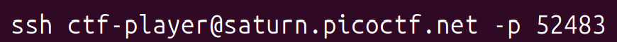
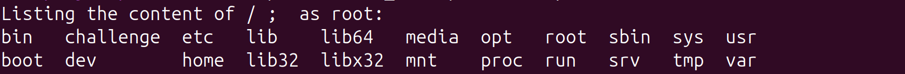
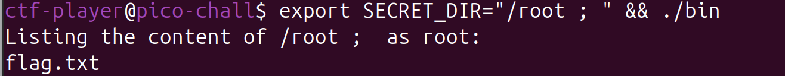
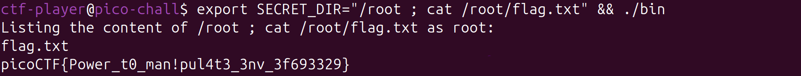

---
tags:
  - PWN
---
# VNE

سلام سلام !
 با یه چالش اومدیم از 
 [picoCTF](https://play.picoctf.org/practice/challenge/387?category=6&difficulty=2&page=1) 
 که کوتاه ولی به شدت جذابه 

اول از همه باید ssh بزنیم تا بتونیم کامند های شل رو اجرا کنیم.

در توضیحات گفته شده که ما دسترسی root نداریم و میتونیم به کمک فایل bin یک دایرکتوری رو انتخاب کنیم و به عنوان ls root بگیریم.

اگر فایل bin رو اجرا کنیم می‌فهمیم که مقدار گلوبال set نشده به اسم SECRET_DIR داریم.

حالا میایم این مقدار رو برابر / قرار می‌دیم و بعد از اجرا کردن bin خروجی این شکلی میشه :

میشه اینجا حدس زد که موقعی که داره bin رو اجرا میکنه میاد دستور ls رو به همراه رشته ای که ما تو متغییر SECRECT_DIR نوشتیم اجرا میکنه و نتیجه ش رو به ما خروجی میده. یعنی عملا ما تو متغییر SECRET_DIR می‌تونیم کامند بش بنویسیم و انتظار داشته باشیم که با دسترسی root ران بشه و نتیجه ش رو ببینیم :

همونطور که ‌می‌بینید تونستیم تو پوشه ls root بگیریم و نتیجه ش رو ببینیم. حالا فقط می‌مونه اینکه فایل flag.txt رو چاپ کنیم !

فلگ پیدا شد !!!

??? success "FLAG :triangular_flag_on_post:"
    
`picoCTF{Power_t0_man!pul4t3_3nv_3f693329}`

--- 

!!! نویسنده
    [sw33tw3as3l](https://github.com/sw33tw3as3l)

	